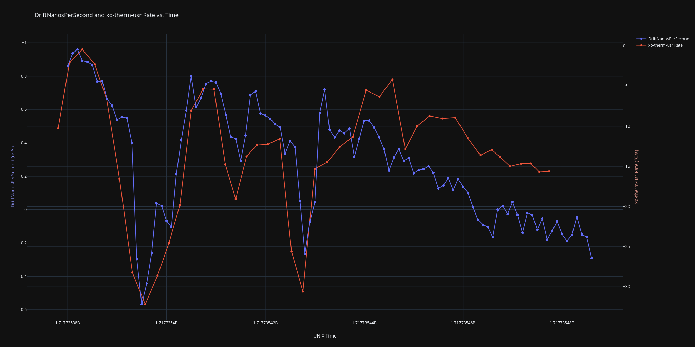

# Thermal Logger

This project logs thermal data from the Android/Linux thermal sysfs found at `/sys/class/thermal`. It's written in C/C++, and can be ran on Android devices using [Termux](https://termux.com/). It uses `clock_gettime()` for time measurements, for up to nanosecond-precision, however the actual accuracy may be far from real-world time (e.g. UTC).

_Plot showing the correlation between clock drift rate calculated using Raw GNSS Measurements and data from a `thermal_zone` labelled "`xo-therm-usr`", collected using Thermal Logger on an Android device_

 Basically, my Android phone (_and likely yours, too_) has **temperature sensors** accessible using the Linux thermal sysfs at `/sys/class/thermal_zoneX/temp` (where `X` is the number of the sensor). Most of these are pretty generic **0.1 ℃** precision and update at **1 Hz**. However, I noticed that a couple sensors on my device have **millicelsius-level precision**. Using [an app called "Temp. Monitor" I found on F-Droid](https://f-droid.org/en/packages/com.gmail.jiwopene.temperature/) (thanks @jiwopene), I found that some of these sensors update at **up to 10 Hz**. Unfortunately, _"Temp. Monitor" can only log temperatures once every minute_.

So, I decided to try writing a program in C/C++ which reads the temperatures from `/sys/class/thermal_zoneX/temp` myself. Using an unthrottled loop held back only by sheer will and a flood of `open()` and `close()` syscalls, I found my device was logging readings from `/sys/class/thermal_zone74/temp` (designated "`xo-therm-usr`") at **~750.6974892 Hz**. Holy crap, SUPER FAST! (Maybe someone can build a laser which can quickly heat/cool one of these sensors and modulate it with a waveform to play audio waveforms ~375 Hz?) I'm not sure what the limit is, and whether or not there is a better way to access these sensors. (I want to believe that there are higher-frequency higher-precision ADC measurements hiding behind the millicelsius-level precision of the sysfs...)

I was also intrigued by the idea of logging the measurements from a sensor named "`xo-therm-usr`". The sensor name suggests it's tied to the temperature of the phone's [XO](https://en.wikipedia.org/wiki/Crystal_oscillator).

The frequency (and thus stability) of these oscillators drifts with temperature. [TCXO](https://en.wikipedia.org/wiki/Crystal_oscillator#Temperature)s (Temperature-compensated Crystal Oscillators) are a popular choice for consumer devices since they will compensate for temperature and keep a tolerance of around **~1 ppm** (parts per **million**) accuracy in the long term. **However, changing temperatures can still decrease their short-term accuracy**, which is important for stuff like GNSS (Global Navigation Satellite System, of which the USA's GPS is probably the most well-known, functioning alongside the EU's Galileo and Russia's GLONASS) because a clock error of **1 ppb** (parts per **billion**) can correspond to a pseudorange **error of 0.299792458 meters/second**! As previously mentioned, TCXOs are usually on the order of **~1 ppm**, meaning **an uncorrected TCXO can drift upwards of 299.792458 meters/second** (**0.299792458 kilometers/second**)! This is quite terrible, so the clock frequency offset is incorporated into the PVT (Position, Velocity, Time) solver, however **any changes in oscillator frequency (like that caused by a change in temperature) will impact the accuracy of the solution**.

So, I hope to use this logger as another way of estimating the uncertainty of my Raw GNSS Measurements. I believe the clock uncertainty is the greatest source of error remaining in our Android devices' GNSS (besides ionospheric delays and signal degredation), since they are  just consumer devices (geodetic equipment, like that used for RTK and Surveying, will almost certainly use an OCXO (oven-compensated crystal oscillator), or at least I hope they would, given the amount of money survey-grade equipment costs...)

It is entirely likely that Qualcomm (the vendor of my phone's SoC) is already correcting the clock using this sensor (or some lower-level access to it), however it looks like there is still a correlation between the `DriftNanosPerSecond` returned by [Android's Raw GNSS Measurements](https://developer.android.com/develop/sensors-and-location/sensors/gnss) (see the plot above).
